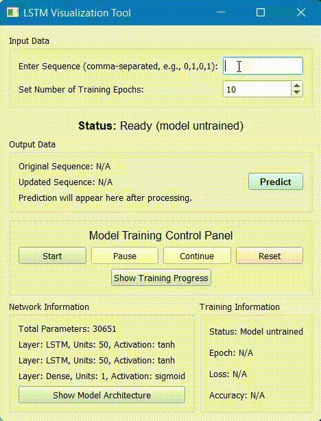

# SFC-project
Long Short-Term Memory (LSTM) demonstration

## Application demonstration 
- entering input sequence: `0,1,0,1`
- started training
- next symbol prediction
  

  

## Training visualization

